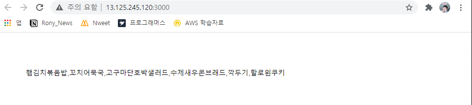
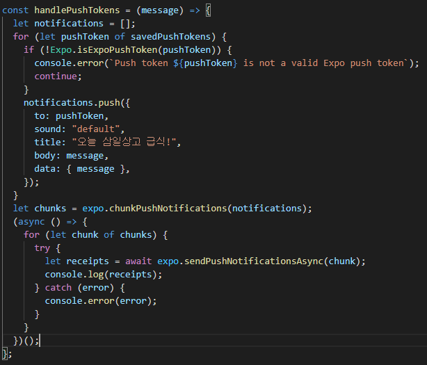
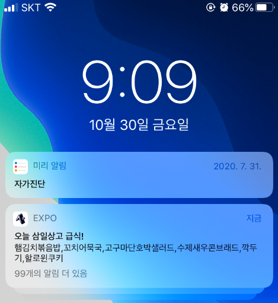
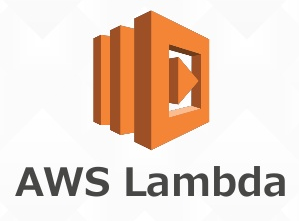

# Ngrok

```javascript
npm i -g ngrok
// ngrok 이란 자신의 로컬 서버를 퍼블릭 dns 로 바꾸어주는 패키지 이다.

ngrok http 3000 
// 매 실행마다 입력해주어 ./App.js
const PUSH_REGISTRATION_ENDPOINT
const MESSAGE_ENPOINT
// 의 엔드포인트 들을 나온 주소에 맞게 수정해주어야 한다
```

# WebView

```javascript
import {WebView} from 'react-native-webview'
<WebView source={{ uri: 'http://www.samil.hs.kr/main.php' }}/>
```
해당 웹뷰 페이지를 열어 모달창의 느낌을 준다.

# 토큰발급

```javascript
import { Notifications } from "expo";
// ---
let token = await Notifications.getExpoPushTokenAsync();
// Notifications.getExpoPushTokenAsync() 를 통하여 토큰을 발급받음
```

# EC2 인스턴스를 API 로 사용

### http://13.125.245.120:3000/
오늘 삼일상업 고등학교 식단표를 불러온다



# 알람 전송

```javascript
{
    to,
    sound,
    title,
    body,
    data
}
// 가 들어있는 객체를
expo.chunkPushNotifications(객체)
// 로 넣어준 후
await expo.sendPushNotificationsAsync(객체)
// 로 쏘아준다면 to 에 들어있는 값에 해당하는 유저에게 알람이 간다.
```


```javascript
Axios.get(ADDR)
.then(res => res처리)
// 해당 부분을
const data = await Axios.get(ADDR)
const response = data.data.(res처리)
// 로 바꾸어줄 수 있다.
```



# AWS Lambda



람다 란 AWS 함수실행 역할을 해주는 도구 이다.

참고로 , 

```javascript
exports.handler = async (event) => {
    event.원하는값
};
// 해당 형태로 되어있는데 이 중 인자로 들어오는 event 는
router.get('/주소' , (req,res) => {
    req.body.원하는값
})
// 과 같은 데이터를 담고있다.
```

# AWS GATEWAY


해당 사진은 API GATEWAY 의 역할을 정리한 것인데

설정해준 경로 , 메서드 와 일치하는 접근이 일어난다면 이벤트를 발생시킬 수 있는데
이 때 아까 설정해둔 AWS Lambda  의 역할을 사용 할 수 있는것이다.


